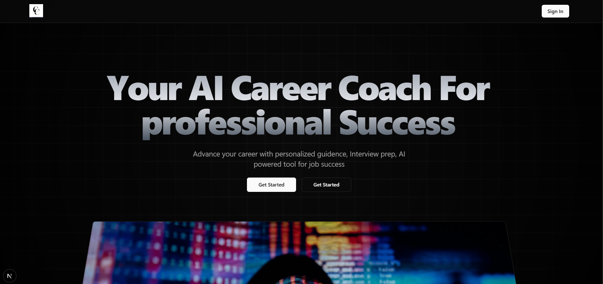
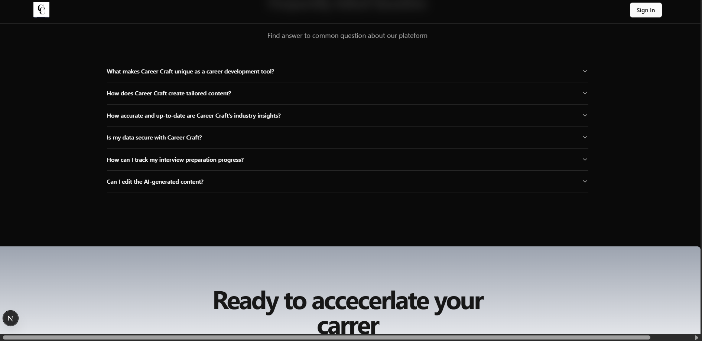
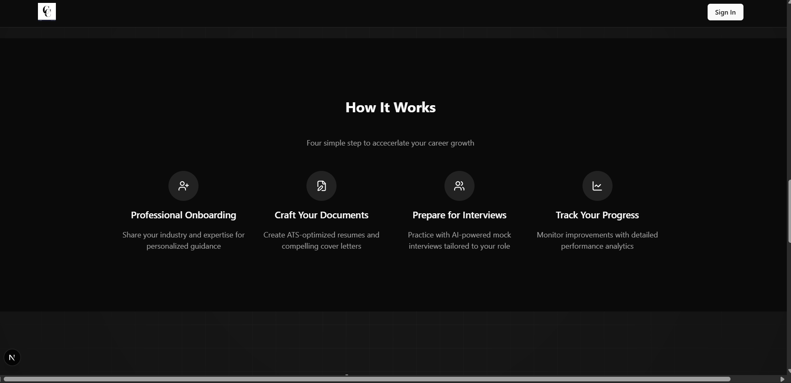
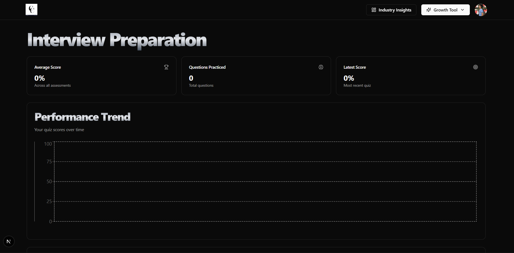
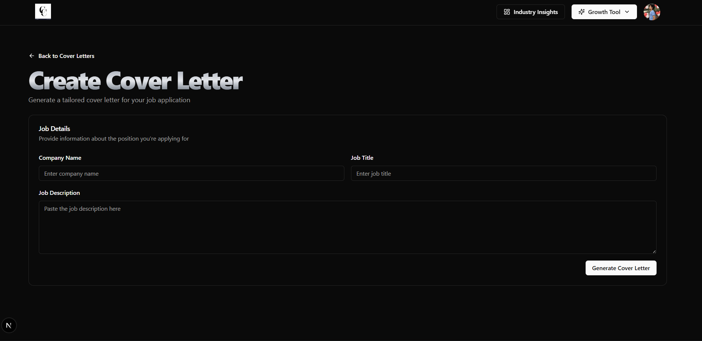
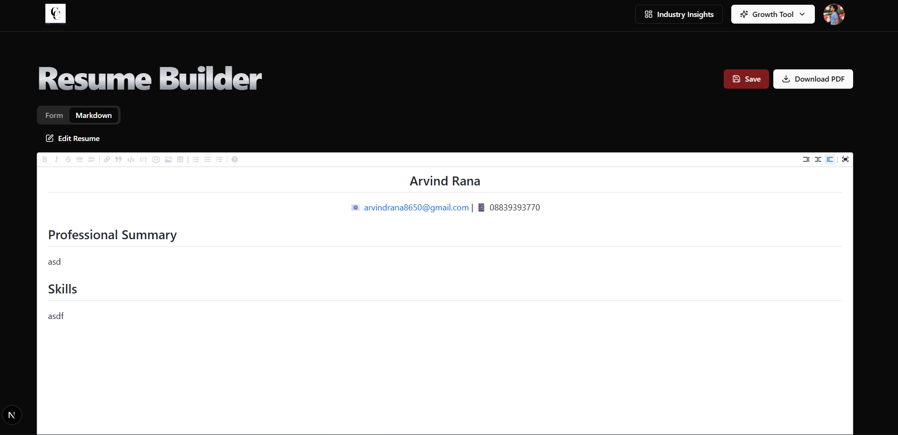

🚀 Career-Craft – AI-Powered Career Development Platform

Career-Craft is a modern full-stack AI platform designed to help students, job seekers, and professionals improve their:

Resume quality

Interview readiness

Communication skills

Technical preparation

Study planning

It integrates AI resume generation, curated study material, interview prep modules, and personalized dashboards—making it a complete digital career coach.

✔ AI-powered resume generator
✔ End-to-end SaaS structure (Auth → Dashboard → Tools → Background Jobs)
✔ Modern UI with reusable components
✔ Production-ready backend design
✔ Fully deployed on Vercel

🛠️ Tech Stack
Frontend:
Next.js (App Router), React.js, Tailwind CSS, Shadcn UI

Backend:
Next.js Server Actions, Prisma ORM, Neon PostgreSQL

AI & Automation:
AI Resume Generation, Role-based Templates, Inngest (Background Jobs)

Authentication:
Clerk Authentication, Protected Routes, Session Management

Utilities & Tools:
Sonner Notifications, Git & GitHub, Vercel Deployment

🖼️ Screenshots

<table> <tr> <td align="center">   <strong>Home Page</strong> </td> <td align="center">   <strong>FAQ Page</strong> </td> </tr> <tr> <td align="center">   <strong>Work Page</strong> </td> <td align="center">   <strong>Interview Page</strong> </td> </tr> <tr> <td align="center">   <strong>Cover Letter Page</strong> </td> <td align="center">   <strong>Resume Builder Page</strong> </td> </tr> </table>

Project Structure 

/src
  📂 app
    📁 dashboard
    📁 resume-builder
    📁 interview-prep
    📁 study-material
    📁 api
    📄 layout.js

  📂 components
    📁 ui
    📄 ResumePreview.js

  📂 lib
    📄 prisma.js
    📄 helpers.js

  📂 hooks
    📄 use-fetch.js
    📄 use-auth.js

  📂 utils
    📄 validators.js
    📄 constants.js

  🎨 styles
    📄 globals.css

  ⚙️ inngest

  🖼️ public
    🖼️ homePage.png
    🖼️ resumeBuilderPage.png

  📄 schema.prisma
  ⚙️ next.config.js
  📦 package.json
  🔐 .env.local
  📘 README.md

⚙️ Installation & Setup
1️⃣ Clone the Repository
git clone https://github.com/arvind-rana/Career-Craft.git
cd career-craft

2️⃣ Install Dependencies
npm install

3️⃣ Configure Environment Variables

Create a .env.local file:

DATABASE_URL=""
CLERK_PUBLISHABLE_KEY=""
CLERK_SECRET_KEY=""
INGEST_API_KEY=""

4️⃣ Run Prisma Migrations
npx prisma migrate dev

5️⃣ Start the Development Server
npm run dev

App will be available at:
👉 http://localhost:3000

✨ Features
📝 AI Resume Builder

Auto-generates ATS-optimized resumes

Multiple industry templates

Keyword-rich suggestions

Export options

🎤 Interview Preparation

HR + technical questions

Behavioral interview prompts

Curated topic-wise guidance

📚 Study Material

Topic-wise learning resources

Well-organized and easy to navigate

🔐 Authentication

Clerk login/signup

Protected routes

User profiles

⚙️ Background Processing

Inngest-powered async workflows

Resume generation queues

Smooth performance

🎨 Modern UI / UX

Tailwind + Shadcn

Responsive design

Elegant and minimal interface

👨‍💻 Author

Arvind Rana
📧 Email: arvindrana8650@gmail.com

🔗 LinkedIn: https://www.linkedin.com/in/arvindrana15/

🔗 Leetcode : https://leetcode.com/u/arvind_rana15/

⭐ Support This Project

If this project inspired you:

⭐ Star the repository
🔁 Share it with others
💬 Open issues or suggestions
